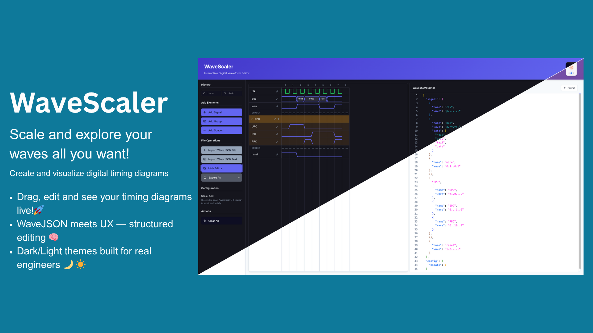

# 🌊 WaveScaler

**A modern, interactive digital waveform editor for the web**

WaveScaler is a powerful, browser-based waveform diagram editor built with SvelteKit and Monaco Editor. Create, edit, and visualize digital timing diagrams using the WaveJSON format with an intuitive interface and advanced editing capabilities.

> **⚠️ Alpha Release** - WaveScaler is currently in active development. While functional, you may encounter bugs or breaking changes. We welcome feedback and contributions!

<!--  -->




# The ***Why*** of it

WaveDrom showed the hardware world that timing diagrams could be written as text and rendered anywhere — great for version-control, terrible for day-to-day editing. Teams still copy-paste raw **WaveJSON** into repos and paste static PNGs into Google Docs, because the stock WaveDrom editor is minimalist. **WaveScaler** turns those script-only workflows into a fully-interactive, SvelteKit-powered experience that’s ready for professional verification teams, technical writers, and IP vendors alike. 

- **WaveDrom (2010-)** introduced *WaveJSON*, a terse language for timing diagrams, rendered to SVG/PNG in-browser.  It solved version-control pain and made diagrams text-diff-friendly. 

- Yet the official WaveDrom Editor stayed a minimal textarea-plus-preview.

- Large-scale SoC projects therefore embed raw WaveJSON blobs in HDL repos and manually export static images for specs — losing interactivity, inviting errors, and wasting review cycles.

## ✨ Features


**So many things to fix at the moment** 

### 🎨 **Interactive Editing**
- **Visual waveform editing** - Click and modify signal values directly on the diagram
- **Monaco Editor integration** - Full-featured JSON editor with syntax highlighting and validation
- **Real-time preview** - See changes as you type
- **Drag-and-drop** - Reorder signals and groups effortlessly

### 🎛️ **Advanced Signal Management**
- **Multi-signal selection** - Select and modify multiple signals at once
- **Signal grouping** - Organize related signals into collapsible groups
- **Wave pattern tools** - Apply values to selections, invert, duplicate
- **Smart spacing** - Add spacers and gaps for better organization

### 💫 **Professional Tools**
- **Command palette** (`Ctrl/Cmd+K`) - Quick access to all functions
- **Undo/Redo system** - Full history with detailed operation tracking
- **Export options** - Save as JSON, SVG, PNG, or JPEG
- **Theme support** - Light and dark themes
- **Keyboard shortcuts** - Efficient editing workflows

### 🚀 **Modern Architecture**
- Built with **SvelteKit** for blazing-fast performance
- **TypeScript** throughout for type safety
- **Tailwind CSS** for beautiful, responsive design
- **Monaco Editor** for professional code editing experience

## 🚀 Quick Start

### Prerequisites
- Node.js 18+ 
- npm, pnpm, or bun

### Installation

```bash
# Clone the repository
git clone https://github.com/cheeksthegeek/wavescaler.git
cd wavescaler

# Install dependencies
npm install

# Start development server
npm run dev
```

Open your browser to `http://localhost:5173` and start creating waveforms!

### 🎯 Some rough guide on how to use (I'll add an interactive guide later on)

#### Interactive Editing
- **Click any cycle** to modify its value
- **Shift+click** for multi-selection
- **Right-click** for context menus
- **Drag** to reorder signals

#### Command Palette (`Ctrl/Cmd+K`)
- Add signals and groups
- Export in multiple formats  
- Clear waveform
- Undo/redo operations

#### Selection Tools
- Select individual cycles, entire signals, or groups
- Apply operations to selections:
  - Set values (`0`, `1`, `x`, `z`, etc.)  
  - Copy/paste patterns
  - Invert logic levels
  - Duplicate selections

## 🛠️ Development

### Project Structure
```
src/
├── lib/
│   ├── components/          # Svelte components
│   ├── command-palette/     # Command system
│   ├── wavejson-*          # WaveJSON parsing/generation
│   └── stores/             # State management
├── routes/                 # SvelteKit routes
└── app.html               # Main HTML template
```

### Available Scripts

```bash
npm run dev          # Start development server
npm run build        # Build for production  
npm run preview      # Preview production build
npm run test         # Run tests
npm run lint         # Lint code
npm run format       # Format code
```

### Contributing

We welcome contributions! 

## 📚 WaveJSON Format

WaveScaler uses the WaveJSON format, which is compatible with WaveDrom. For detailed format documentation, see the [WaveDrom tutorial](https://wavedrom.com/tutorial.html).

## 🎨 Themes

WaveScaler supports both light and dark themes. Toggle between themes using the theme button in the toolbar or `Ctrl/Cmd+Shift+T`.


## 📄 License

This project is licensed under the MIT License - see the [LICENSE](LICENSE) file for details.

## 🙏 Acknowledgments

- Inspired by [WaveDrom](https://wavedrom.com/) 
- Built with [SvelteKit](https://kit.svelte.dev/)
- Powered by [Monaco Editor](https://microsoft.github.io/monaco-editor/)
